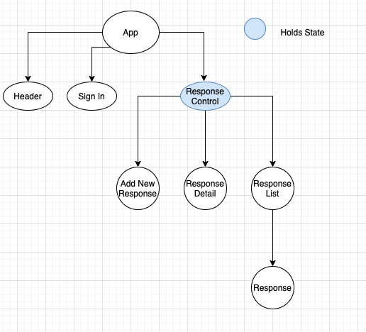

# 
Become bffs

     
    

  <small>Last Updated: March 5th, 2021</small>

# ℹ️ Description

What a feeling when you meet someone that you have a connection with. What do you do with that connection if it's not a romantic one? The hesistation to open up and time constraints impede deep connections from developing. What if there was a space where people could commit to developing a relationship and do so on their own schedule? Becoming BFFs will create a platform for two people to form a deeper connection by being prompted to share stories, facts, and answers to the deep questions about their lives.

# ✅ Objectives

Create a space for two people to share intimacy on the internet.

# 💁🏽‍♀️ User Stories

# 📊 Components Diagram

# 🧗🏼‍♀️ Stretch Goals

# 🧑‍💻 Contributer

| Name                                                         | GitHub Profile                                  |
| ------------------------------------------------------------ | ----------------------------------------------- |
| [Bess Campbelll](https://www.linkedin.com/in/bess-campbell/) | [besscampbell](https://github.com/besscampbell) |

# ⚙️ Technologies Used

- [Visual Studio Code](https://code.visualstudio.com/)
- [Git/GitHub](https://github.com/)
- [React Native]()
- [JavaScript]()
- [CSS](https://developer.mozilla.org/en-US/docs/Learn/CSS)
- [Bootstrap](https://getbootstrap.com/)
- [Node.js](https://nodejs.org/en/)
- [npm](https://www.npmjs.com/get-npm)
- [Babel](https://babeljs.io/)
- [Eslint](https://eslint.org/)
- [Webpack](https://webpack.js.org/)
- [Expo CLI]()
- [XCode]()
- [DrawIO](https://www.draw.io/)

# 📰 Other Resources

- [The Experimental Generation of Interpersonal Closeness by Arthur Aron](https://journals.sagepub.com/doi/pdf/10.1177/0146167297234003)
- [To Fall in Love With Anyone, Do This by Mandy Len Catron](https://www.nytimes.com/2015/01/11/style/modern-love-to-fall-in-love-with-anyone-do-this.html)

# 💾 Installation Requirements

## For Both Mac & Windows systems

#### To Clone:

- Open your preferred command line program.
- Navigate to the location or directory you'd like the project directory to be created in. (e.g., `cd Desktop` if you'd like to clone the project to your desktop)
- Enter the command `$ git clone https://github.com/besscampbell/kombucha-bar.git` in your command line.

#### To Download:

- Navigate to the [project repository](https://github.com/besscampbell/kombucha-bar.git) in your browser.
- Click the green "Code" button toward the top right of the page.
- Click "Download ZIP" and extract the files.
- Open the newly-downloaded project in your preferred code editor.

# 🖥️ Opening the Project on your Local System

Once the project has been cloned and you have all the necessary items on your local computer, open the project in the application of your choice ([Visual Code Studio](https://code.visualstudio.com/) was used and is recommended by the application builder)

### Run the project:

1. In the terminal type `npm install` to install the JSON package
2. Once the install has finished type `npm run build` into the terminal to compile the project
3. Run `npm start` to view the site in a browser.

### To test:

1. Navigate to the `__tests__` folder in the project file tree.
2. Run `npm test` and you see a return of which tests are passing/failing in the terminal.

# ☎️ Support / Contact Details

- [Bess Campbell](mailto:bess.k.campbell@gmail.com)

# 🐛 Bugs / Issues

| Date | Error | Handled | Solution |
| :--- | :---- | :------ | :------- |
|      |       | ✅      |          |

# ©️ License & Copyright

Copyright (c) 2021 _*Bess Cammpbell*_
